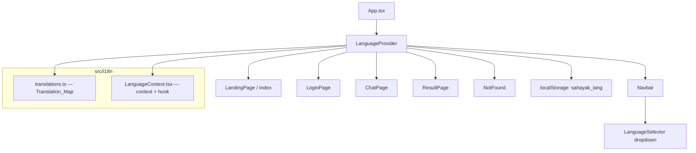

# Design Document: Multi-Language Support

## Overview

This feature replaces the existing two-language toggle (Hindi/English) with a full multi-language system supporting 11 Indian languages. The implementation centres on a `LanguageContext` React context that holds the active language and a `t()` translation function. A `Translation_Map` file contains all UI strings for every language. The `Navbar` gains a dropdown `LanguageSelector` component. All pages consume the context instead of receiving `lang` as a prop.

The existing codebase already has partial translations for `hi`, `en`, and `ta` scattered across individual page files (`Index.tsx`, `LoginPage.tsx`, `ChatPage.tsx`, `ResultPage.tsx`). The design consolidates all strings into a single source of truth and extends coverage to 11 languages.

---

## Architecture



**Key design decisions:**

- **Single Translation_Map file** (`src/i18n/translations.ts`): All strings in one place makes it easy to add languages and audit coverage.
- **Context over prop drilling**: The existing `lang` prop passed from `App.tsx` down to every page is removed. Pages call `useLanguage()` directly.
- **`t(key)` helper**: A typed translate function avoids string typos and enables IDE autocomplete.
- **Fallback to English**: If a key is missing in the selected language, the `t()` function returns the English value, preventing blank UI.

---

## Components and Interfaces

### `LanguageContext` (`src/i18n/LanguageContext.tsx`)

```typescript
type LangCode = "en" | "hi" | "bn" | "te" | "mr" | "ta" | "gu" | "kn" | "ml" | "pa" | "or";

interface LanguageContextValue {
  lang: LangCode;
  setLanguage: (code: LangCode) => void;
  t: (key: TranslationKey) => string;
}
```

- Reads `localStorage.getItem("sahayak_lang")` on mount; validates against `SUPPORTED_LANGS`; defaults to `"hi"`.
- Writes to `localStorage` on every `setLanguage` call.
- `t(key)` returns `translations[lang][key] ?? translations["en"][key]`.

### `LanguageSelector` (`src/components/LanguageSelector.tsx`)

A dropdown button rendered inside `Navbar`. Uses a `useRef` + `useEffect` click-outside handler (same pattern as the existing user menu in `Navbar.tsx`).

```typescript
interface Language {
  code: LangCode;
  nativeName: string;
  flag: string;
  speechLocale: string; // BCP 47, e.g. "hi-IN"
}
```

Renders the active language's flag + native name as the trigger button. The dropdown lists all 11 languages.

### Updated `Navbar` (`src/components/Navbar.tsx`)

- Removes `lang` and `onSetLang` props.
- Imports `useLanguage()` for the logout label translation.
- Renders `<LanguageSelector />` in place of the old toggle button.

### Updated Pages

All pages (`Index.tsx`, `LoginPage.tsx`, `ChatPage.tsx`, `ResultPage.tsx`, `NotFound.tsx`) are updated to:
- Remove the `lang` prop from their interface.
- Call `const { t, lang } = useLanguage()` internally.
- Replace inline `content[lang]` / `UI[lang]` lookups with `t("key")` calls.

### Updated `App.tsx`

- Wraps `AppRoutes` with `<LanguageProvider>`.
- Removes the `lang` / `setLang` state and prop passing.
- `ResultPage` no longer needs `lang` from `App`; it reads from context.

---

## Data Models

### `SUPPORTED_LANGS` constant

```typescript
export const SUPPORTED_LANGS: Language[] = [
  { code: "hi", nativeName: "हिंदी",    flag: "🇮🇳", speechLocale: "hi-IN" },
  { code: "en", nativeName: "English",  flag: "🇬🇧", speechLocale: "en-IN" },
  { code: "bn", nativeName: "বাংলা",    flag: "🇮🇳", speechLocale: "bn-IN" },
  { code: "te", nativeName: "తెలుగు",   flag: "🇮🇳", speechLocale: "te-IN" },
  { code: "mr", nativeName: "मराठी",    flag: "🇮🇳", speechLocale: "mr-IN" },
  { code: "ta", nativeName: "தமிழ்",    flag: "🇮🇳", speechLocale: "ta-IN" },
  { code: "gu", nativeName: "ગુજરાતી",  flag: "🇮🇳", speechLocale: "gu-IN" },
  { code: "kn", nativeName: "ಕನ್ನಡ",    flag: "🇮🇳", speechLocale: "kn-IN" },
  { code: "ml", nativeName: "മലയാളം",   flag: "🇮🇳", speechLocale: "ml-IN" },
  { code: "pa", nativeName: "ਪੰਜਾਬੀ",   flag: "🇮🇳", speechLocale: "pa-IN" },
  { code: "or", nativeName: "ଓଡ଼ିଆ",    flag: "🇮🇳", speechLocale: "or-IN" },
];
```

### `TranslationKey` type

A union of all string literal keys present in the translation map, generated from the `en` entry (the canonical source). This gives compile-time safety when calling `t("key")`.

```typescript
export type TranslationKey = keyof typeof translations["en"];
```

### `translations` object shape (abbreviated)

```typescript
export const translations: Record<LangCode, Record<string, string>> = {
  en: {
    // Navbar
    "nav.logout": "Logout",
    // Index
    "home.headline": "Know",
    "home.headlineHighlight": "Government Schemes",
    // ... all keys
  },
  hi: { /* ... */ },
  ta: { /* ... */ },
  // remaining 8 languages
};
```

All existing inline translation objects (`content`, `UI`, `STATIC`) in the page files are migrated into this single map.

---

## Correctness Properties

*A property is a characteristic or behavior that should hold true across all valid executions of a system — essentially, a formal statement about what the system should do. Properties serve as the bridge between human-readable specifications and machine-verifiable correctness guarantees.*

### Property 1: Language persistence round-trip

*For any* valid `LangCode` from `SUPPORTED_LANGS`, calling `setLanguage(code)` writes that code to `localStorage`, and re-initialising the `LanguageContext` by reading from `localStorage` should produce a context whose `lang` equals `code`.

**Validates: Requirements 3.1, 3.2**

---

### Property 2: Non-supported stored value defaults to Hindi

*For any* string that is not a valid `LangCode` (including empty string, `null`, and arbitrary text), if it is present in `localStorage` under `sahayak_lang` when the context initialises, the resulting `lang` should be `"hi"`.

**Validates: Requirements 3.3, 3.4**

---

### Property 3: Translation fallback to English

*For any* `LangCode` and *for any* `TranslationKey` that is present in the English translation map but absent in the selected language's map, calling `t(key)` should return the English string rather than `undefined` or an empty string.

**Validates: Requirements 2.8**

---

### Property 4: All English keys are non-empty strings

*For any* key in the English translation map, the value should be a non-empty string. This validates that the canonical source has no blank or missing translations across all pages and the Navbar.

**Validates: Requirements 2.2, 2.3, 2.4, 2.5, 2.6, 2.7**

---

### Property 5: Supported language completeness (translations + speech locale)

*For any* entry in `SUPPORTED_LANGS`, the `translations` object should contain a non-empty map for that `LangCode`, and the entry's `speechLocale` field should match the BCP 47 pattern `^[a-z]{2}-[A-Z]{2}$`.

**Validates: Requirements 4.1 – 4.11, 6.2**

---

### Property 6: LanguageSelector displays active language label

*For any* active `LangCode`, the rendered `LanguageSelector` trigger button's text content should contain the `nativeName` of the language corresponding to that code in `SUPPORTED_LANGS`.

**Validates: Requirements 1.1**

---

### Property 7: Language selection updates context

*For any* `LangCode` selected via the `LanguageSelector`, the `LanguageContext`'s `lang` value should equal the selected code immediately after selection.

**Validates: Requirements 1.3, 2.1**

---

## Error Handling

| Scenario | Behaviour |
|---|---|
| `localStorage` unavailable (private browsing, quota exceeded) | `setLanguage` catches the write error silently; the in-memory language still updates |
| `useLanguage()` called outside `LanguageProvider` | Throws `Error("useLanguage must be used within a LanguageProvider")` |
| Translation key not found in active language | `t()` falls back to English value; if also missing in English, returns the key string itself as a last resort |
| Speech recognition not supported in browser | Existing `isSpeechSupported()` guard in `ChatPage` handles this; no change needed |

---

## Testing Strategy

### Unit Tests

- `LanguageContext` initialisation with valid, invalid, and missing `localStorage` values
- `t()` fallback behaviour when a key is missing in the active language
- `LanguageSelector` renders the correct active language label
- `LanguageSelector` closes on outside click

### Property-Based Tests

Using **fast-check** (already compatible with Vitest, the project's test runner):

- **Property 1** — Language persistence round-trip: generate random `LangCode` from `SUPPORTED_LANGS`, call `setLanguage`, re-init context from `localStorage`, assert `lang` matches.
- **Property 2** — Invalid stored language defaults to Hindi: generate arbitrary strings not in `SUPPORTED_LANGS`, write to `localStorage`, init context, assert `lang === "hi"`.
- **Property 3** — Translation fallback: generate random `TranslationKey`, set a language with a deliberately empty translation map, assert `t(key)` returns the English value.
- **Property 4** — All English keys non-empty: iterate all keys in `translations["en"]`, assert each value is a non-empty string.
- **Property 5** — Supported language completeness: for each entry in `SUPPORTED_LANGS`, assert `translations[code]` exists and is non-empty.

Each property test runs a minimum of 100 iterations.

Tag format: `Feature: multi-language-support, Property {N}: {property_text}`
